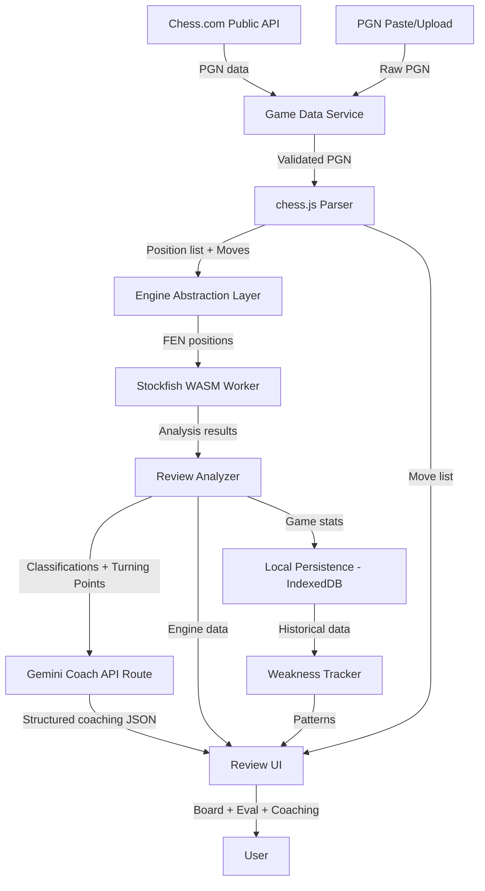

# ChessCoach — Implementation Plan

> **Repository:** `D:\AI\chess-analyzer`
> **Status:** ✅ Approved — Ready for implementation.

---

## Executive Summary

Build a production-ready web application that lets Chess.com players review their games with Stockfish-powered analysis and Gemini-powered beginner-friendly coaching. The core philosophy:

- **Stockfish** tells the player WHAT went wrong.
- **Gemini AI** explains WHY it went wrong.
- **Recurring weakness tracking** helps the player IMPROVE.

Target user: beginner players (~400–1200 Elo).

---

## Prompt Review — Finalized Decisions

> [!NOTE]
> The following changes were applied to the original prompt based on review. All accepted.

### ✅ Kept As-Is (Core Strengths)
- Stockfish as single source of chess truth — Gemini never invents moves
- Server-side Gemini API key protection
- Chess.com public API archive-based retrieval
- Deterministic fallback when Gemini is unavailable
- Engine abstraction interface for future server-side Stockfish
- Structured Gemini output with Zod validation
- GPL license compliance for Stockfish (Chessground avoided via `react-chessboard` MIT)
- Demo mode with bundled PGN

### ✏️ Modified

| # | Original | Decision | Rationale |
|---|----------|----------|-----------|
| 1 | Chessground for board | **Use `react-chessboard` (MIT-licensed)** | Avoids GPL viral licensing complexity for the entire app. `react-chessboard` wraps `chessboardjsx` with React 18 support, is MIT-licensed, and has native React integration. |
| 2 | Stockfish 18 WASM | **Use `stockfish.js` (latest WASM build) from npm** — pin to the latest stable version at install time | "Stockfish 18" may not have a stable WASM build. The `stockfish.js` or `lila-stockfish-web` packages are the maintained WASM distributions. |
| 3 | 9 implementation phases | **Consolidated to 6 phases** | Phases 7–9 in the original are too granular and can be merged. Keeps momentum and avoids "planning paralysis." |
| 4 | `BRILLIANT` / `GREAT` classifications | **Removed for MVP** — ship with `BEST → GOOD → INACCURACY → MISTAKE → BLUNDER → MISSED_WIN` | These require deep tactical validation (sacrifice detection, etc.) that's hard to get right. Add brilliant/great post-MVP. |
| 5 | Full training mode | **MVP: "Retry This Position" only** | A full training platform is scope creep. MVP lets user retry the exact position where they blundered. Spaced repetition / puzzle generation is Phase 2 of the product. |
| 6 | IndexedDB for persistence | **Use `idb` (tiny IndexedDB wrapper)** | Raw IndexedDB API is painful. `idb` is < 1KB and provides a Promise-based API. |
| 7 | Dashboard route | **Deferred to post-MVP** | Home page + games list + review page + profile summary are sufficient for MVP. |
| 8 | Recurring weakness detection | **Simplified** — count tag frequencies across games, no trend charts for MVP | Bar chart trends require 5+ games to be meaningful. Start with simple frequency counts. |

### ➕ Added

| # | Addition | Rationale |
|---|----------|-----------|
| 1 | **`.env.local` gitignored by default** | Next.js convention. The `.env.example` is documented but `.env.local` must never be committed. |
| 2 | **Stockfish loading fallback** | If WASM is unsupported (rare), show a clear message instead of a blank screen. No JS fallback engine — just a graceful error. |
| 3 | **PGN paste as primary flow** alongside Chess.com username | Many users will want to paste a PGN from Lichess, OTB, or other sources. Elevate this to equal prominence. |
| 4 | **Dark/Light mode toggle** | The prompt specifies "dark-first" but doesn't mention a toggle. Add one — many users prefer light mode. Implement via CSS custom properties + `next-themes`. |
| 5 | **Move sound effects** | Subtle piece-move sounds dramatically improve board feel. Use free CC0 sounds. |
| 6 | **Shareable review link architecture** | Even without a backend, design the URL structure (`/review/[gameId]`) so that adding link sharing later is trivial. |
| 7 | **Error boundary at review page level** | Stockfish/WASM crashes should not white-screen the entire app. |

### ❌ Removed / Deferred to Post-MVP

| # | Removed | Rationale |
|---|---------|-----------|
| 1 | Opening repertoire tracking | Out of scope for a game reviewer |
| 2 | Spaced repetition system | Requires significant additional architecture |
| 3 | Coach conversations (chat) | Gemini coaching cards are sufficient for MVP |
| 4 | Game comparison side-by-side | Nice-to-have, not MVP |
| 5 | Progress graphs / charts | Deferred until enough data is collected |
| 6 | Chess.com OAuth | No auth for MVP |
| 7 | Server-side Stockfish | Browser WASM is sufficient for MVP depths |
| 8 | `/settings` route | Preferences stored locally, no dedicated page needed for MVP |

---

## Technology Stack (Final)

| Layer | Technology | Version Strategy |
|-------|-----------|-----------------|
| Framework | Next.js (App Router) | Latest stable |
| Language | TypeScript | Strict mode |
| Styling | Tailwind CSS | Latest stable |
| Icons | Lucide React | Latest stable |
| Chess Logic | `chess.js` | Latest stable |
| Board | `react-chessboard` (MIT) | Latest stable |
| Engine | `stockfish.js` / `lila-stockfish-web` WASM | Latest stable |
| AI | `@google/genai` | Latest stable |
| Validation | Zod | Latest stable |
| DB (client) | IndexedDB via `idb` | Latest stable |
| Theme | `next-themes` | Latest stable |

---

## Architecture Diagram



---

## Project Structure

```
chess-analyzer/
├── public/
│   └── stockfish/              # WASM + worker files
├── src/
│   ├── app/
│   │   ├── layout.tsx          # Root layout, fonts, theme
│   │   ├── page.tsx            # Home / landing page
│   │   ├── games/
│   │   │   └── page.tsx        # Recent games list
│   │   ├── review/
│   │   │   └── [gameId]/
│   │   │       └── page.tsx    # Game review page
│   │   ├── training/
│   │   │   └── page.tsx        # Training (MVP: retry positions)
│   │   ├── profile/
│   │   │   └── page.tsx        # Player stats + weaknesses
│   │   ├── licenses/
│   │   │   └── page.tsx        # Open source licenses
│   │   └── api/
│   │       ├── chesscom/
│   │       │   ├── player/route.ts
│   │       │   └── games/route.ts
│   │       └── coach/
│   │           └── route.ts    # Gemini coaching endpoint
│   ├── components/
│   │   ├── ui/                 # Generic UI primitives
│   │   ├── chess/              # Board, EvalBar, MoveList
│   │   ├── review/             # ReviewSummary, CoachCard
│   │   ├── coach/              # CoachingPanel, WhyMissed
│   │   └── layout/             # Header, Footer, Navigation
│   ├── lib/
│   │   ├── chesscom/           # Chess.com API service
│   │   ├── chess/              # PGN parsing, move processing
│   │   ├── engine/             # Engine abstraction + Stockfish worker
│   │   ├── review/             # Classification, accuracy, turning points
│   │   ├── coaching/           # Gemini client, prompts, fallbacks
│   │   ├── persistence/        # IndexedDB repositories
│   │   ├── validation/         # Zod schemas
│   │   └── utils/              # Helpers, formatting
│   ├── hooks/                  # Custom React hooks
│   ├── types/                  # Shared TypeScript types
│   └── config/                 # App config, constants
├── tests/
│   ├── lib/
│   ├── components/
│   └── fixtures/               # Sample PGNs, mock data
├── .env.example
├── .env.local                  # gitignored
├── next.config.ts
├── tailwind.config.ts
├── tsconfig.json
├── package.json
└── LICENSES.md                 # Third-party license attributions
```

---

## Implementation Phases

### Phase 1 — Foundation & Design System
**Estimated effort: Day 1**

- [ ] Initialize Next.js App Router project with TypeScript
- [ ] Configure Tailwind CSS with custom dark-first design tokens
- [ ] Set up `next-themes` for dark/light mode
- [ ] Install and configure ESLint, Prettier
- [ ] Create `.env.example` with all required variables
- [ ] Create root layout with Inter/Geist font
- [ ] Build shared UI components: Button, Input, Card, Badge, Skeleton, Alert
- [ ] Build app shell: Header, Navigation, Footer
- [ ] Create home/landing page with username input + PGN paste
- [ ] Create "Try Demo Game" button with bundled PGN
- [ ] Create error boundary component
- [ ] Create loading state components with contextual messages
- [ ] Set up `/licenses` page with Stockfish, chess.js, and board library attributions

**Exit criteria:** App runs, has polished landing page, dark/light toggle works, all base UI components exist.

---

### Phase 2 — Chess.com Integration & Game Selection
**Estimated effort: Day 1–2**

- [ ] Create Chess.com API service (`lib/chesscom/`)
  - `getPlayer(username)` — validate player exists
  - `getArchives(username)` — fetch archive list
  - `getGamesFromArchive(url)` — fetch games from a month
  - `getRecentGames(username, count)` — walk archives backwards
- [ ] Create Zod schemas for all Chess.com API responses
- [ ] Implement time-control parser (bullet/blitz/rapid/daily/classical)
- [ ] Create server-side API routes (`/api/chesscom/player`, `/api/chesscom/games`)
- [ ] Handle errors: 404, 429, 403, network, timeout
- [ ] Build username search UI with all states (loading, not found, no games, error)
- [ ] Build recent games page (`/games`) with:
  - Game cards showing date, opponent, result, time control, ratings
  - Win/Loss/Draw visual indicators
  - Filtering by time control + color + result
  - Sorting by date
- [ ] Create PGN paste/upload alternative flow
- [ ] Validate uploaded/pasted PGN with chess.js

**Exit criteria:** Can search a real Chess.com username, see their recent games, filter them, and select one. Can also paste a PGN.

---

### Phase 3 — Chess Engine & Analysis Pipeline
**Estimated effort: Day 2–3**

- [ ] Set up chess.js for PGN parsing and position generation
- [ ] Create `GameMove` data structure with FEN before/after for every ply
- [ ] Preserve game metadata (players, ratings, result, time control, etc.)
- [ ] Create engine abstraction interface (`ChessEngine`)
- [ ] Implement `StockfishBrowserEngine` using Dedicated Web Worker
- [ ] Configure Stockfish WASM files in `public/stockfish/`
- [ ] Implement UCI protocol communication (uci, isready, position, go, stop)
- [ ] Create analysis queue with:
  - Priority: current position > critical positions > remaining
  - Incremental result emission
  - Cancellation support
  - Progress tracking
- [ ] Implement analysis depth modes (Quick=10, Standard=14, Deep=18)
- [ ] Create analysis cache keyed by `FEN + depth`
- [ ] Build evaluation normalization (always from player's perspective)
- [ ] Handle mate scores separately from centipawn scores

**Exit criteria:** Can parse a PGN, generate all positions, run Stockfish analysis on each, and get best moves + evaluations without freezing the UI. Progress is visible.

---

### Phase 4 — Review Engine & Classification
**Estimated effort: Day 2–3**

- [ ] Implement move classification system:
  - Compare played move vs best move
  - Calculate evaluation loss
  - Handle mate transitions
  - Classify: `BEST`, `GOOD`, `INACCURACY`, `MISTAKE`, `BLUNDER`, `MISSED_WIN`
- [ ] Implement beginner coaching tags:
  - `HANGING_PIECE`, `MISSED_FORK`, `MISSED_CHECK`, `MISSED_CAPTURE`
  - `MISSED_MATE`, `QUEEN_ADVENTURE`, `UNDEVELOPED_PIECE`, `LOST_MATERIAL`
- [ ] Calculate ChessCoach Accuracy score (transparent formula, documented)
- [ ] Implement turning point detection (3–5 key moments per game)
- [ ] Calculate material difference at each position
- [ ] Extract principal variations (2–5 moves, "Show more" for advanced)
- [ ] Build review summary: result, accuracy, mistake counts, biggest weakness, main lesson
- [ ] Identify opening name (best-effort, "Unknown" if not found)
- [ ] Analyse time management if clock data available

**Exit criteria:** Every move in a game is classified, accuracy is calculated, turning points are identified, coaching tags are applied.

---

### Phase 5 — Board UI, Review Page & Gemini Coach
**Estimated effort: Day 3–4**

#### Board & Review UI
- [ ] Integrate `react-chessboard` with custom arrow/highlight overlays
- [ ] Implement board orientation (White/Black)
- [ ] Build vertical evaluation bar with smooth animation, mate display
- [ ] Build move list with SAN notation, classification icons, click-to-navigate, auto-scroll
- [ ] Build navigation controls: First, Prev, Next, Last, Auto-play, Next Mistake, Next Blunder
- [ ] Implement keyboard navigation (← → Home End Space)
- [ ] Draw engine arrows: green (best move), red (threat/blunder)
- [ ] Build review page layout — desktop (board left, info right) + mobile (stacked)
- [ ] Show analysis progress bar
- [ ] Show review summary card
- [ ] Add move sound effects

#### Gemini Coach
- [ ] Create secure `/api/coach/route.ts` — server-side only
- [ ] Implement rate limiting / throttling on coach endpoint
- [ ] Build Gemini coaching prompt (beginner-friendly, never invents moves)
- [ ] Define Zod schema for structured Gemini response:
  ```
  { title, explanation, whatYouMissed, immediateThreat, whyBestMoveWorks, lesson, difficulty, tags }
  ```
- [ ] Implement retry + safe parsing for invalid Gemini responses
- [ ] Build deterministic fallback templates (works without Gemini)
- [ ] Build coaching card UI showing: What happened? → What did you miss? → Better move → Why? → Remember
- [ ] Implement "Why did I miss this?" secondary coaching interaction
- [ ] Only send turning points / critical positions to Gemini (not every move)

**Exit criteria:** Full review page works end-to-end. Board is interactive, arrows show, eval bar animates, coaching cards appear for mistakes. Works even with Gemini unavailable.

---

### Phase 6 — Persistence, Polish & Production
**Estimated effort: Day 4–5**

#### Persistence & Player Intelligence
- [ ] Set up IndexedDB via `idb` with repository pattern
- [ ] Persist analysed games locally
- [ ] Track stats: games reviewed, average accuracy, blunders/game
- [ ] Calculate recurring weakness frequencies across games
- [ ] Build profile page (`/profile`) showing stats + weakness summary
- [ ] Build "Retry This Position" — simple training from own blunders

#### Polish
- [ ] Responsive layout testing and fixes (mobile, tablet, desktop)
- [ ] Accessibility: ARIA labels, focus states, keyboard nav, contrast, reduced motion
- [ ] All error states: Chess.com errors, Stockfish failures, Gemini failures
- [ ] All empty states: no games, no analysis, no weaknesses yet
- [ ] Loading states with contextual messages
- [ ] Demo mode: bundled PGN with precomputed analysis
- [ ] Engine/AI attribution disclosures
- [ ] Chess.com trademark disclaimer
- [ ] Open source licenses page complete

#### Testing & Build
- [ ] Unit tests: Chess.com service, PGN parser, evaluation logic, classification, Gemini validation
- [ ] Integration tests: review flow, navigation, error handling
- [ ] `npm run lint` — passes
- [ ] `npm run typecheck` — passes
- [ ] `npm test` — passes
- [ ] `npm run build` — passes
- [ ] Verify: no API key in client bundle
- [ ] Verify: Stockfish WASM loads in production build
- [ ] End-to-end test with real Chess.com user (e.g., `hikaru`)
- [ ] End-to-end test with demo game

**Exit criteria:** Production build passes. All acceptance criteria from the prompt are met. App works end-to-end with real data.

---

## Key Architectural Decisions

### 1. Board Library — `react-chessboard` (MIT)

Chosen over Chessground (GPL) to avoid viral licensing concerns. Custom arrow/highlight implementation will be needed but keeps the project MIT-compatible and commercially safe. Chessground remains a viable fallback if `react-chessboard` proves insufficient.

### 2. Stockfish WASM Distribution
- Use `stockfish.js` npm package or download WASM binary to `public/stockfish/`
- Single-threaded lite variant for broad browser compatibility
- SharedArrayBuffer (multi-threaded) can be added later with proper COOP/COEP headers

### 3. State Management
- React Context + `useReducer` for review page state (current move index, analysis results)
- No Redux/Zustand — the state is page-local, not global
- Single source of truth: move index drives board position, eval bar, coaching card, and move list

### 4. Gemini Cost Control
- Only 3–5 turning points sent to Gemini per game (not all moves)
- Responses cached in IndexedDB
- Deterministic fallback means Gemini calls are optional

---

## Environment Variables

```env
# Required
GEMINI_API_KEY=                          # Server-side only, never exposed to browser

# Optional (have defaults)
GEMINI_MODEL=gemini-2.5-flash            # Configurable AI model
CHESSCOM_USER_AGENT=ChessCoach/1.0       # Identifies app to Chess.com API
NEXT_PUBLIC_APP_NAME=ChessCoach          # Public app name (changeable)
```

---

## Acceptance Criteria Checklist

Carried forward from the prompt — all must pass before the project is considered complete. See the original prompt sections 82–83 for the full checklist.

---

## Risk Register

| Risk | Likelihood | Impact | Mitigation |
|------|-----------|--------|------------|
| Stockfish WASM doesn't load on some browsers | Low | High | Feature detection + clear error message |
| Chess.com rate limits during development | Medium | Medium | Cache responses, add retry with backoff |
| Gemini structured output is unreliable | Medium | Low | Zod validation + deterministic fallback |
| `react-chessboard` missing features (arrows, highlights) | Medium | Medium | Custom SVG overlay implementation planned |
| Bundle size too large (Stockfish WASM) | Medium | Medium | Lazy-load engine only on review page |
| Analysis too slow on low-end devices | Medium | Medium | Default to Quick (depth 10), let user choose deeper |

---

> [!TIP]
> Plan approved. All decisions finalized. Implementation can begin with Phase 1 on the next prompt.
